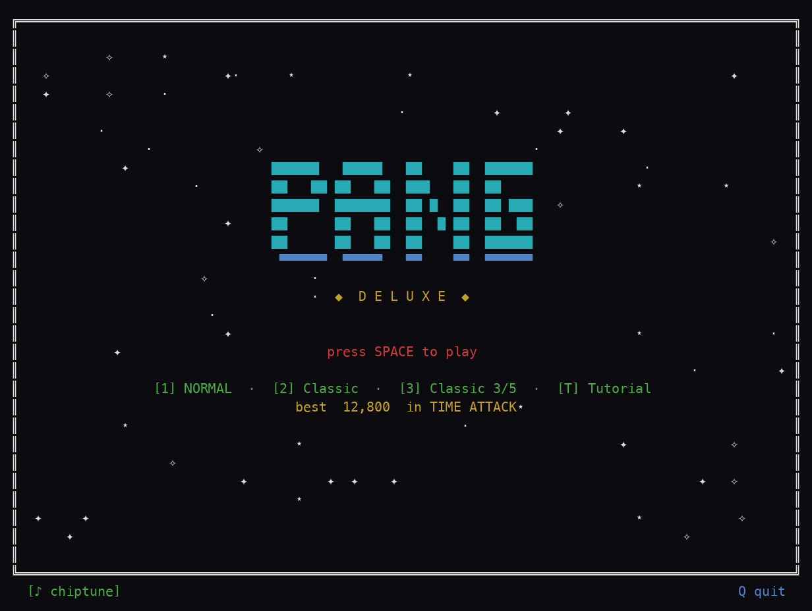
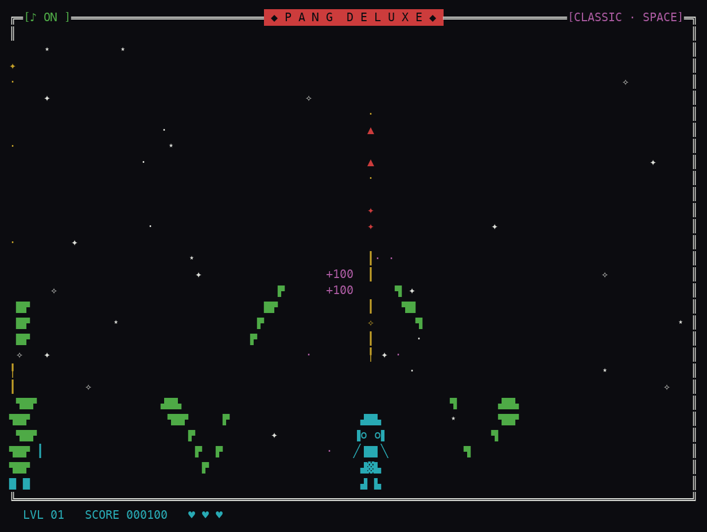

<div align="center">



# 🫧 PANG DELUXE

**Un tributo a Pang / Buster Bros para tu terminal: revienta bolas con el arpón antes de que te aplasten.**


</div>

---

## Qué es esto

**Pang Deluxe** es un arcade de terminal escrito en Python puro, un homenaje directo al clásico
**Pang / Buster Bros**. Las bolas caen y rebotan por la pantalla; tú las revientas con tu arpón,
y al hacerlo se parten en bolas más pequeñas que caen más rápido. Vacía el nivel sin que ninguna
te aplaste.

Todo está dibujado con arte de bloques y caracteres de cuadro, con partículas de chispas, combos
encadenados y un motor **chiptune sintetizado a mano** que suena en tiempo real. Y todo usando
**solo la librería estándar de Python** — sin dependencias externas.

Bajo el capó hay mucho más que el modo básico:

- **5 modos de juego**: Clásico, Contrarreloj, Supervivencia, Boss Rush y Diario (semilla determinista por día).
- **Arsenal de armas y powerups**: arpón, gancho pegajoso, pistola de pulsos, rayo ancho, doble, perforante, triple, espejo, escudo, imán, fantasma, auto-apuntado y bomba.
- **Variantes de bola**: pincho, hielo, explosiva, magnética, oro y jefes con barra de HP.
- **3 dificultades y 4 personajes** con estadísticas distintas.
- **Mundos temáticos** (Espacio, Mar, Volcán, Neón) con gravedad y peligros propios.
- **Enemigos** (cangrejo, murciélago), logros y persistencia de top-10 por modo.
- **Accesibilidad**: modo daltónico, silencio y ocultar puntuación.

## 🎮 Cómo se juega

Mueve a tu personaje por la base de la pantalla y dispara el arpón hacia arriba. Cada bola que
revientas se parte en dos más pequeñas; encadénalas para subir el combo. Esquiva las bolas que
caen, recoge los powerups y limpia el nivel antes de quedarte sin vidas.

| Tecla | Acción |
| --- | --- |
| `←` `→` / `A` `D` | Mover |
| `Espacio` | Disparar arpón |
| `P` / `Esc` | Pausa |
| `M` | Silenciar / activar audio |
| `J` | Música on/off |
| `C` | Overlays daltónicos |
| `H` | Ocultar puntuación |
| `1` / `2` / `3` | (Título) dificultad / personaje / skin |
| `T` | (Título) tutorial |
| `Q` | Salir / volver |

## 🚀 Cómo ejecutar

```bash
python3 pang.py
```

Requiere **Python 3.8+** y una terminal de al menos **64×22** con soporte Unicode. Sin dependencias
externas: todo corre con la librería estándar. El guardado vive en `~/.pang_save.json`.

> El audio chiptune se activa si hay un backend disponible (`libsoundio`/`portaudio` vía `ctypes`).
> Si no lo hay, el juego corre igual, en silencio.

## 📸 Captura

<div align="center">



*Nivel 1 en modo Clásico: el arpón sube, las bolas se parten en chispas verdes y el combo `+100` se encadena.*

</div>

## 🛠️ Bajo el capó

- **Python 3.8+**, solo librería estándar.
- Renderizado en terminal con **`curses`**: arte de bloques, caracteres de cuadro y un sistema de partículas propio.
- Física a **60 FPS** con gravedad, rebotes y splitting de bolas por tamaño.
- **Motor de audio chiptune propio** (`pang_audio.py`): síntesis en tiempo real con osciladores, envolventes y efectos, conectada vía `ctypes` a `libsoundio`/`portaudio` cuando están presentes.
- Persistencia local en `~/.pang_save.json`: high scores por modo, logros y ajustes.
- Generación determinista del modo Diario mediante semilla derivada de la fecha (hash).

## 📦 Créditos

Publicado por [@gavilanbe](https://github.com/gavilanbe). Un tributo cariñoso a **Pang / Buster Bros**,
hecho por hobby para la terminal. 🎮

## 📄 Licencia

[MIT](LICENSE)
